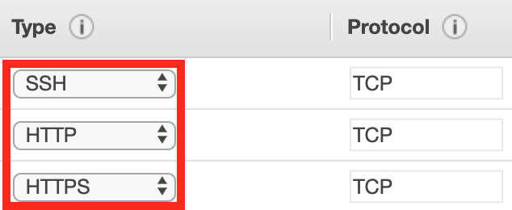

# dear-sns


100% inspired by Twitter, fundamental SNS features developed by Next.js

[Demo](http://dear-sns.club)  

*****
## At a glance


### Why divided into front-end / back-end 'server' ? 🤷🏻‍♀️🤷🏼‍♂️

Because the rolls are different.🍴  
Front is to transmit mainly HTML/CSS and JS files.  
On the other hand, Back is to store and handle data from Front accordingly.  

## Getting started

### DB configuration

Before we start, please check [Sequelize's documentation](http://docs.sequelizejs.com/manual/migrations.html)   

As mentioned in the document, edit `config/config.json` file as yours       
It should look like down below:

```sh
{
  "development": {
    "username": "Your DB username",
    "password": "Your DB password",
    "database": "database_development",
    "host": "127.0.0.1",
    "dialect": "mysql"
  },
                .
                .
                .
}

```

### ERD


### Association

A user can make many posts and comments; one-to-many => `hasMany`   
Little tricky thing here is generally a hashtag can have many posts. Let's imagine #love on Instagram
likewise, a post so in this case, we set both like below so      
`db.Post.belongsToMany(db.Hashtag, { through: 'PostHashtag' };`   
`db.Hashtag.belongsToMany(db.Post, { through: 'PostHashtag' });`   
Due to 'belongsToMany' association, we need to use `through` attribute to create new model `PostHashtag`   
You can also look up these associations [Sequelize's documentation](http://docs.sequelizejs.com/class/lib/associations/base.js~Association.html)


## AWS

As we discussed, let's create two instances - front and back


In the process to launch an instance, if you have reached ***Step 6: Configure Security Group***   
Please add rules HTTP and HTTPS so that we can access it front side



### Installing Node

Before installing Node on your Ubuntu or Amazon Linux whatever you have chosen, we should kindly update it as the newest version
```sh
apt-get update
```

then, please install down below to install essential thigs
```sh
apt-get install -y build essential
```

We use Node 10.x version
```sh
curl -sL https://deb.nodesource.com/setup_10.x | sudo -E bash --
```

Once you have finished installation above, now we finally install Node
```sh
apt-get install -y nodejs
```

Now remember, as we have two servers, we need to do it for back-end server as well   
Plus, we should install MySQL ***only for back-end server***
```sh
apt-get install -y mysql-server
```


