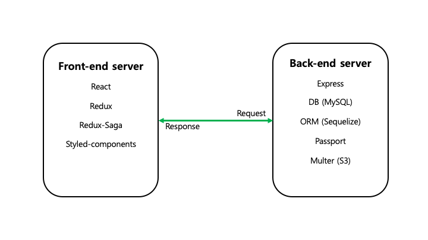
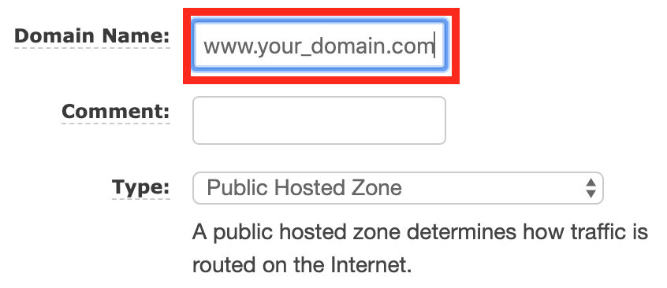
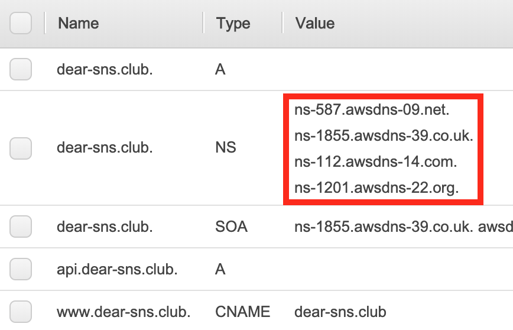

# dear-sns


100% inspired by Twitter, fundamental SNS features developed by Next.js

[Demo](http://dear-sns.club)  

*****
## At a glance


### Why divided into front-end / back-end 'server' ? 🤷🏻‍♀️🤷🏼‍♂️

Because the rolls are different.🍴  
Front is to transmit mainly HTML/CSS and JS files.  
On the other hand, Back is to store and handle data from Front accordingly.  

## Getting started

### DB configuration

Before we start, please check [Sequelize's documentation](http://docs.sequelizejs.com/manual/migrations.html)   

As mentioned in the document, edit `config/config.json` file as yours       
It should look like down below:

```sh
{
  "development": {
    "username": "Your DB username",
    "password": "Your DB password",
    "database": "database_development",
    "host": "127.0.0.1",
    "dialect": "mysql"
  },
                .
                .
                .
}

```

### ERD


### Association

A user can make many posts and comments; one-to-many => `hasMany`   
Little tricky thing here is generally a hashtag can have many posts. Let's imagine #love on Instagram
likewise, a post so in this case, we set both like below so      
`db.Post.belongsToMany(db.Hashtag, { through: 'PostHashtag' };`   
`db.Hashtag.belongsToMany(db.Post, { through: 'PostHashtag' });`   
Due to 'belongsToMany' association, we need to use `through` attribute to create new model `PostHashtag`   
You can also look up these associations [Sequelize's documentation](http://docs.sequelizejs.com/class/lib/associations/base.js~Association.html)


## AWS

As we discussed, let's create two instances - front and back


In the process to launch an instance, if you have reached ***Step 6: Configure Security Group***   
Please add rules HTTP and HTTPS so that we can access it front side


### Installing Node & MySQL

Before installing Node on your Ubuntu or Amazon Linux whatever you have chosen, we should kindly update it as the newest version
```sh
apt-get update
```

then, please install down below for essential thigs
```sh
apt-get install -y build essential
```

We use Node 10.x version
```sh
curl -sL https://deb.nodesource.com/setup_10.x | sudo -E bash --
```

Once you have finished installation above, now we finally install Node
```sh
apt-get install -y nodejs
```

Now remember, as we have two servers, we need to do it for back-end server as well   
Plus, we should install MySQL ***only for back-end server***
```sh
apt-get install -y mysql-server
```
```
mysql_secure_installation
```

### Cloning this repository

```sh
git clone https://github.com/footlessbird/react-sns.git
```

After cloning, let's move to `/front` directory and make sure that we got both Node and NPM successfully installed
```sh
node -v
npm -v
```
after that commands if you see versions like so `10.16.0`, `6.9.0` then we are good to go

install all the dependencies
```sh
npm i
```

Exactly same for back-end but move to `/back` directory


### NPM build and start

before running server we need build it first
```sh
npm run build
```
now we can do below to run
```
npm start
```


If you see it, it's running in background


We can also check logs
```sh
pm2 monit
```
See more detail please check [PM2](http://pm2.keymetrics.io/docs/usage/pm2-doc-single-page/)

Same thing for back-end this time as well👯‍♀️

### MySQL error handling

If you face error showing by pm2 monit in back-end server   
***Client does not support authentication protocol requested by server...***
Check [here](https://stackoverflow.com/questions/50093144/mysql-8-0-client-does-not-support-authentication-protocol-requested-by-server)


### Sequelize setting
Let's move to back-end server `/back` and install below
```sh
npm i -g sequelize-cli
```

```sh
sequelize db:create
```
If you see `Database name_of_database created.`, we are good to go and please kindly restart the server

```sh
pm2 reload all && pm2 monit
```
You can restart server and monitor at the same time by doing so


Let's check DB tables have been succussfully created

## Applying domain

To use custom domain, you might want buy one from one of domain sellers such as Namecheap, GoDaddy and many more   

### Route 53
Let's go to one of AWS services called ***Route 53***


Click `Create Hosted Zone`   

Enter your domain in the `Domain Name:` box



You'll see your domain appeared, click your domain   

Domain where you have bought might have manage-option for your domain and there might be nameservers   
Please kindly replace them with things in the red box in the picture below



Same page, in the picture above, there is `Create Record Set`   
Click it then you'll see the picture below


In the red box, please enter your front-end server's public IP (IPv4 Public IP)   

Same thing for back-end server but back-end server's public IP (IPv4 Public IP) and very first red box `Name:` enter `api`   

If you want to use `www` like www.your-domain.com `Name:` enter `www` change `Type:` to `CNAME - Canocial name` and `Value:` enter your domain like `www.your-domain.com` 


